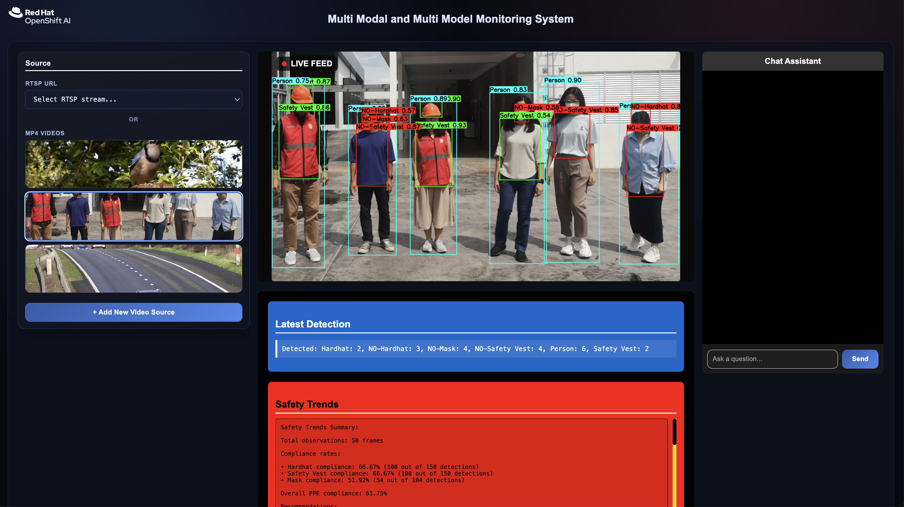
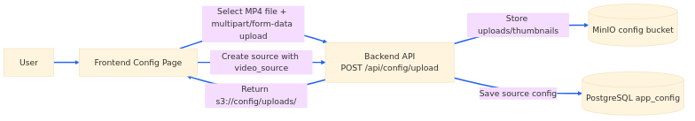
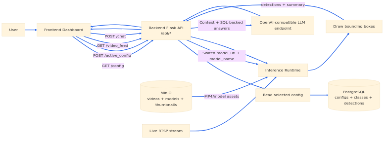

<!-- omit from toc -->
# Deploy AI-powered video analytics for workplace safety

Monitor workplace safety and operational compliance in real time using AI object detection, multimodal analysis, and conversational insights. 

<!-- omit from toc -->
## Table of Contents
- [Detailed description](#detailed-description)
  - [See it in action](#see-it-in-action)
  - [Architecture diagrams](#architecture-diagrams)
  - [Video upload workflow](#video-upload-workflow)
  - [Application workflow](#application-workflow)
  - [Components](#components)
  - [Storage strategy](#storage-strategy)
- [Requirements](#requirements)
  - [Minimum hardware expectations](#minimum-hardware-expectations)
  - [Minimum software requirements](#minimum-software-requirements)
  - [Required user permissions](#required-user-permissions)
- [Configuration](#configuration)
- [Deploy](#deploy)
  - [Prerequisites](#prerequisites)
  - [Supported model-serving profiles](#supported-model-serving-profiles)
  - [Installation steps](#installation-steps)
  - [Deployment workflow](#deployment-workflow)
  - [Helm values](#helm-values)
  - [Delete](#delete)
  - [Local development (Podman Compose)](#local-development-podman-compose)
  - [Local development (no containers)](#local-development-no-containers)
- [Training a custom model](#training-a-custom-model)
- [API endpoints](#api-endpoints)
  - [Example request](#example-request)
- [Reference](#reference)
- [Tags](#tags)


## Detailed description

Organizations face challenges maintaining workplace safety and operational compliance across facilities with multiple video feeds. Manual monitoring is resource-intensive and reactive, often missing critical events or patterns that indicate safety risks or operational inefficiencies.



This AI quickstart provides a complete multimodal monitoring solution that combines computer vision and large language models (LLMs) to analyze video streams in real time. The application uses trained object-detection models to identify objects, people, and events in live RTSP feeds or uploaded video files. Users can monitor multiple video sources through an interactive dashboard, view detection overlays, and ask questions about what the AI has observed using a conversational chat interface.

**Key capabilities:**

- **Real-time analysis**: Process live RTSP streams or MP4 files with per-source configuration and model selection
- **Persistent storage**: Upload and manage video sources backed by MinIO object storage and PostgreSQL database
- **Visual monitoring**: View detection results, overlays, and automated safety summaries through a React dashboard
- **Conversational insights**: Query the system using an OpenAI-compatible LLM with LangGraph/LangChain and optional SQL-backed tools
- **Flexible deployment**: Run locally with Podman Compose, bare-metal development, or deploy to Kubernetes/OpenShift with Triton/KServe or OpenVINO Model Server
- **Model customization**: Train and deploy custom object detection models using the included Jupyter notebook workflow
- **Annotation support**: Optional Label Studio integration for creating and refining training datasets

Upload a video or connect an RTSP stream to see the AI detection in action. The dashboard displays:
- Live video feed with bounding boxes around detected objects
- Real-time safety and operational summaries
- Object tracking across frames
- Interactive chat for querying detection history

### See it in action

[Interactive walkthrough](https://interact.redhat.com/share/WLiZJXMoQn2x9fGdNY0P)


### Architecture diagrams

Static overview (SVG): [`docs/images/architecture.svg`](docs/images/architecture.svg). Additional slides: [`docs/architecture-slides.html`](docs/architecture-slides.html) (see [`docs/architecture-slides-README.md`](docs/architecture-slides-README.md)). The workflow figures below are PNG exports from Mermaid sources (**click a diagram to open the full-resolution PNG**). See [`docs/mermaid.README.md`](docs/mermaid.README.md) for what the `.mmd` files are and how to regenerate the thumbnails and large images.

| Layer / component | Technology | Purpose / description |
|-------------------|------------|------------------------|
| **UI** | React, React Router, Axios | Dashboard, RTSP/MP4 source selection, configuration page, chat with Markdown |
| **API** | Flask (`/api/*`) | Config, active source, video feed, chat, uploads |
| **Inference** | OVMS (`ovmsclient`) or Triton (`tritonclient` via KServe) | Model serving; gRPC inference from the backend |
| **Tracking** | BoxMOT (BoostTrack++) | Multi-object tracking |
| **LLM** | OpenAI-compatible API, LangGraph / LangChain | Chat; optional read-only **postgres-mcp** SQL tools |
| **Observability** | Arize Phoenix (optional) | Tracing |
| **Storage** | MinIO | Models, videos, uploads, thumbnails, config objects |
| **Database** | PostgreSQL | Configs, classes, tracks, observations |
| **Prep / seed** | yolo-model-prep (local), data-loader (init) | Export/build model repo from `app/models/*.pt`; seed MinIO |
| **Annotation (optional)** | Label Studio | Same PostgreSQL + MinIO stack |

### Video upload workflow

[](docs/images/video-upload-workflow-large.png)

### Application workflow

[](docs/images/application-workflow-large.png)

### Components

- **Backend** (Flask, OpenCV): Video decode, MJPEG output, and drawn overlays; inference over gRPC to OpenVINO Model Server (`ovmsclient`, local/CPU) or Triton via `tritonclient` (KServe / GPU path); multi-object tracking with BoxMOT (BoostTrack++); PostgreSQL for app configs, classes, tracks, and observations; MinIO for object storage; LLM chat with LangGraph / LangChain (OpenAI-compatible API) and optional read-only postgres-mcp for SQL tools; optional Arize Phoenix for tracing
- **Frontend** (React, React Router, Axios): Dashboard, source selection (RTSP / MP4 thumbnails), configuration page, and chat with Markdown rendering
- **OpenVINO Model Server (OVMS)**: Model serving runtime; local stack also runs yolo-model-prep (Ultralytics-based export) to build the model repo from `app/models/*.pt` before OVMS starts
- **MinIO**: S3-compatible object storage for models, videos, uploads, and config-related objects
- **PostgreSQL**: Durable storage for multi-source configs and tracking data
- **Data loader**: Init container that seeds model and video objects into MinIO
- **Label Studio** (optional): Annotation UI using the same PostgreSQL and MinIO stack

### Storage strategy

All models and video files are stored in MinIO rather than baked into container images:

| Deployment | Storage method |
|------------|----------------|
| OpenShift/K8s | Files downloaded from MinIO to PVC by init container |
| Local (Podman) | Files downloaded from MinIO at runtime via Python client |

## Requirements

### Minimum hardware expectations

- **KServe / Triton** (`RUNTIME_TYPE=kserve`, e.g. `make deploy` / `make deploy-gpu`): plan for **GPU-capable** worker nodes appropriate to your model-serving footprint; sizing depends on model and cluster policy.
- **OpenVINO Model Server** (`RUNTIME_TYPE=openvino`, e.g. `make deploy-openvino`): targeted at **CPU-oriented** model serving—confirm node CPU/memory with your platform team.

### Minimum software requirements

- Podman + `podman-compose` for local container runs
- Docker (optional alternative)
- Helm (for Kubernetes/OpenShift deployment)
- OpenShift Client CLI (`oc`) when deploying to or operating against an OpenShift cluster

### Required user permissions

- **Project / namespace** permissions sufficient to install the Helm release (workloads, routes, PVCs, Services, etc.).
- **Cluster administrator** may be required when enabling OpenShift integrations that install SCCs or cluster-scoped bindings—see chart flags such as `openshift.scc.enabled`, `openshift.scc.name`, and `openshift.roleBinding.*`.

## Configuration

Copy `.env.example` to `.env` and fill in your values. The `.env.example`
file contains the required OpenAI-compatible LLM variables:
`OPENAI_API_TOKEN`, `OPENAI_API_ENDPOINT`, `OPENAI_MODEL`, and
`OPENAI_TEMPERATURE`.

**Important:** When specifying `OPENAI_API_ENDPOINT`, include `/v1` at the end
(for example, `https://your-api-endpoint.example.com/v1`).

OpenShift/Kubernetes **`make deploy`** targets run **`check-openai-env`** and
prompt for any missing OpenAI values, writing them to `.env`. Local workflows
(`make local-build-up`, `make dev-backend`) do **not** run that prompt — create
`.env` yourself before starting the backend so the chat stack can initialize.

Which **`make deploy`** variant to use (GPU vs CPU model serving, Label Studio)
is covered under **[Deploy](#deploy)** → **Supported model-serving profiles**.

Backend environment variables:
- `PORT`: backend port (default `8888`)
- `FLASK_DEBUG`: set to `true` to enable debug mode
- `CORS_ORIGINS`: allowed origins, comma-separated or `*`

Frontend runtime config (`app/frontend/public/env.js` or mounted in containers):
- `API_URL`: backend base URL (example: `http://localhost:8888`)

## Deploy

The sections below cover **cluster** deployment (build, push, Helm install) and **local** workflows. Configure OpenAI-related variables in `.env` first — see **[Configuration](#configuration)**.

### Prerequisites

- `.env` populated for OpenAI-compatible chat where used (see **Configuration**); cluster **`make deploy`** targets run `check-openai-env` interactively if values are missing.
- Container registry access for **`make push`** and **`make build-push-data`** as configured in your environment.
- **Requirements** satisfied for your target (Helm, `oc` for OpenShift, etc.).

### Supported model-serving profiles

All targets below use the same Helm chart and `.env` OpenAI settings; they differ
only by model-serving runtime (`RUNTIME_TYPE`) and optional Label Studio.

| Makefile target | Model serving | Label Studio |
|-----------------|---------------|--------------|
| `make deploy` or `make deploy-gpu` | KServe / Triton (`RUNTIME_TYPE=kserve`) | off |
| `make deploy-openvino` | OpenVINO Model Server (`RUNTIME_TYPE=openvino`) | off |
| `make deploy-labelstudio` | KServe / Triton | on |
| `make deploy-openvino-labelstudio` | OpenVINO Model Server | on |

### Installation steps

1. **Clone this repository** to your workstation (use your fork or upstream URL as appropriate).

2. **Configure the application** — copy `.env.example` to `.env` and set variables as described in **[Configuration](#configuration)**.

3. **Build and push images**

```bash
# Build backend and frontend images
make build

# Push to registry
make push

# Build and push data loader image (contains model/video for MinIO upload)
make build-push-data
```

4. **Install on the cluster** — pick a profile from **Supported model-serving profiles**, then run one of:

```bash
make deploy NAMESPACE=<your-namespace>
```

```bash
make deploy-openvino NAMESPACE=<your-namespace>
```

```bash
make deploy-labelstudio NAMESPACE=<your-namespace>
```

```bash
make deploy-openvino-labelstudio NAMESPACE=<your-namespace>
```

5. **Operate and tune** — see **Deployment workflow**, **Helm values**, and OpenShift-specific chart options below.

### Deployment workflow

1. **MinIO** starts (from `ai-architecture-charts` dependency)
2. **Backend Pod Init Container 1** (`upload-data`): Uploads model/video to MinIO
3. **Backend Pod Init Container 2** (`download-data`): Downloads files from MinIO to PVC
4. **Backend** starts with `MINIO_ENABLED=false`, reads from PVC paths
5. **Frontend** connects to backend API

### Helm values

Override settings (from the repository root; chart path matches **`HELM_CHART`** in the root **`Makefile`**):

```bash
export HELM_CHART=$(grep '^HELM_CHART ?=' Makefile | sed 's/^HELM_CHART ?= //')
helm upgrade multimodal-monitoring "$HELM_CHART" \
  --set frontend.apiUrl=/api \
  --set backend.corsOrigins=http://your-frontend-host \
  --set storage.size=2Gi
```

OpenShift-specific options are included in the chart:
- Frontend Route: `openshift.route.enabled` and optional `openshift.route.host`
- Backend Route: `openshift.backendRoute.enabled` and optional `openshift.backendRoute.host`
- Label Studio Route: `labelStudio.enabled`, `labelStudio.route.enabled`, `labelStudio.route.host`
- Shared Route host (same host for frontend + backend): `openshift.sharedHost`
- NetworkPolicy: `openshift.networkPolicy.enabled`
- SCC/RoleBinding: `openshift.scc.enabled`, `openshift.scc.name`, `openshift.roleBinding.*`

### Delete

Remove the deployed application from your cluster:

```bash
make undeploy NAMESPACE=<your-namespace>
```

### Local development (Podman Compose)

#### Build and run

```bash
make local-build-up
```

This starts:
1. **MinIO** - Object storage (ports 9000, 9001)
2. **data-loader** - Uploads model/video to MinIO (runs once)
3. **backend** - Flask API with `MINIO_ENABLED=true` (port 8888)
4. **frontend** - React app (port 3000)
5. **Label Studio** - Annotation UI backed by the same PostgreSQL + MinIO stack (port 8082)

#### Run without rebuild

```bash
make local-up
```

#### Stop

```bash
make local-down
```

#### Access

- Frontend: http://localhost:3000
- Backend API: http://localhost:8888/api/
- MinIO Console: http://localhost:9001 (login: `minioadmin` / `minioadmin`)
- Label Studio: http://localhost:8082

### Local development (no containers)

#### Backend

```bash
make dev-backend
```

Note: Requires model and video files in `app/models/` and `app/data/` directories.

#### Frontend

```bash
make dev-frontend
```

## Training a custom model

To train a YOLO model for badge detection (or other object classes) using your own images:

1. **Install JupyterLab:**
   ```bash
   pip install jupyterlab
   ```

2. **Run the training notebook:**
   ```bash
   cd training
   jupyter lab
   ```
   Then open `yolo_training.ipynb` and run the cells in order.

The `training/` folder includes an example dataset. See the [detailed training README](training/README.md) for the full training process, notebook steps, and dataset requirements.

## API endpoints

| Endpoint | Method | Description |
|----------|--------|-------------|
| `/api/` | GET | Health check |
| `/api/video_feed` | GET | MJPEG video stream |
| `/api/latest_info` | GET | Latest description and summary |
| `/api/ask_question` | POST | Question answering based on context |
| `/api/chat` | POST | Rule-based response using detections |

### Example request

```bash
curl -X POST http://localhost:8888/ask_question \
  -H 'Content-Type: application/json' \
  -d '{"question": "How many people are detected?"}'
```

## Reference

### Related resources

- [Ultralytics YOLO](https://docs.ultralytics.com/) - Object detection model framework
- [OpenVINO Model Server](https://docs.openvino.ai/latest/ovms_what_is_openvino_model_server.html) - Model serving runtime documentation
- [KServe](https://kserve.github.io/website/) - Kubernetes-based model serving platform
- [Label Studio](https://labelstud.io/) - Data annotation and labeling tool
- [LangGraph](https://langchain-ai.github.io/langgraph/) - Framework for building stateful LLM applications

### Project components

- [BoxMOT](https://github.com/mikel-brostrom/boxmot) - Multi-object tracking library
- [Arize Phoenix](https://docs.arize.com/phoenix/) - LLM observability and tracing
- [MinIO](https://min.io/) - S3-compatible object storage

## Tags

- **Industry:** Manufacturing
- **Product:** Red Hat OpenShift AI
- **Use case:** Multimodal monitoring, object detection, workplace safety
