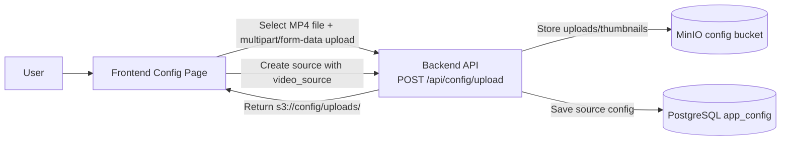
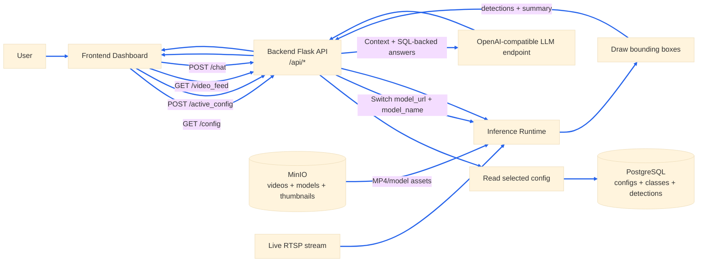

# PPE Compliance Monitor Demo

This repository contains a Flask backend that performs object detection on a video
stream and a React frontend that visualizes the results and provides a chat UI.

## Overview

The application uses trained object-detection models to analyze live video
streams and uploaded video files. In the UI, users can monitor live RTSP feeds
or select MP4 sources from thumbnails, and selecting a source activates its
associated configuration. The backend then switches to the model tied to that
selected source, runs inference on the stream, and returns detection results
and safety/compliance summaries in real time.

## Architecture

### Video Upload Workflow



### Application Workflow



### Components

- **Backend** (Flask, OpenCV): video decode, MJPEG output, and drawn overlays; **inference** over gRPC to **OpenVINO Model Server** (`ovmsclient`, local/CPU) or **Triton** via `tritonclient` (KServe / GPU path); **multi-object tracking** with **Supervision** (ByteTrack); **PostgreSQL** for app configs, classes, tracks, and observations; **MinIO** for object storage; **LLM chat** with **LangGraph** / **LangChain** (OpenAI-compatible API) and optional read-only **postgres-mcp** for SQL tools; optional **Arize Phoenix** for tracing
- **Frontend** (React, React Router, Axios): dashboard, source selection (RTSP / MP4 thumbnails), configuration page, and chat with Markdown rendering
- **OpenVINO Model Server (OVMS)**: model serving; local stack also runs **yolo-model-prep** (Ultralytics-based export) to build the model repo from `app/models/*.pt` before OVMS starts
- **MinIO**: S3-compatible object storage for models, videos, uploads, and config-related objects
- **PostgreSQL**: durable storage for multi-source configs and tracking data
- **Data Loader**: init container that seeds model and video objects into MinIO
- **Label Studio** (optional): annotation UI using the same PostgreSQL and MinIO stack

### Storage Strategy

All models and video files are stored in MinIO rather than baked into container images:

| Deployment | Storage Method |
|------------|----------------|
| OpenShift/K8s | Files downloaded from MinIO to PVC by init container |
| Local (Podman) | Files downloaded from MinIO at runtime via Python client |

## Prerequisites

- Podman + `podman-compose` for local container runs
- Docker (optional alternative)
- Helm (for Kubernetes/OpenShift deployment)

## Configuration

Copy `.env.example` to `.env` and fill in your values. The `.env.example`
file contains the required OpenAI-compatible LLM variables:
`OPENAI_API_TOKEN`, `OPENAI_API_ENDPOINT`, `OPENAI_MODEL`, and
`OPENAI_TEMPERATURE`.

**Important:** When specifying `OPENAI_API_ENDPOINT`, include `/v1` at the end
(for example, `https://your-api-endpoint.example.com/v1`).

OpenShift/Kubernetes **`make deploy`** targets run **`check-openai-env`** and
prompt for any missing OpenAI values, writing them to `.env`. Local workflows
(`make local-build-up`, `make dev-backend`) do **not** run that prompt — create
`.env` yourself before starting the backend so the chat stack can initialize.

Which **`make deploy`** variant to use (GPU vs CPU model serving, Label Studio)
is covered under **OpenShift/Kubernetes Deployment**.

Backend environment variables:
- `PORT`: backend port (default `8888`)
- `FLASK_DEBUG`: set to `true` to enable debug mode
- `CORS_ORIGINS`: allowed origins, comma-separated or `*`

Frontend runtime config (`app/frontend/public/env.js` or mounted in containers):
- `API_URL`: backend base URL (example: `http://localhost:8888`)

## Local Development (Podman Compose)

### Build and Run

```bash
make local-build-up
```

This starts:
1. **MinIO** - Object storage (ports 9000, 9001)
2. **data-loader** - Uploads model/video to MinIO (runs once)
3. **backend** - Flask API with `MINIO_ENABLED=true` (port 8888)
4. **frontend** - React app (port 3000)
5. **Label Studio** - Annotation UI backed by the same PostgreSQL + MinIO stack (port 8082)

### Run Without Rebuild

```bash
make local-up
```

### Stop

```bash
make local-down
```

### Access

- Frontend: http://localhost:3000
- Backend API: http://localhost:8888/api/
- MinIO Console: http://localhost:9001 (login: `minioadmin` / `minioadmin`)
- Label Studio: http://localhost:8082

## Local Development (No Containers)

### Backend

```bash
make dev-backend
```

Note: Requires model and video files in `app/models/` and `app/data/` directories.

### Frontend

```bash
make dev-frontend
```

## Training a Custom Model

To train a YOLO model for badge detection (or other object classes) using your own images:

1. **Install JupyterLab:**
   ```bash
   pip install jupyterlab
   ```

2. **Run the training notebook:**
   ```bash
   cd training/example
   jupyter lab
   ```
   Then open `yolo_training.ipynb` and run the cells in order.

The `training/` folder includes an example dataset and a [detailed README](training/README.md) with the full training process, notebook steps, and dataset requirements.

## OpenShift/Kubernetes Deployment

Configure OpenAI-related variables in `.env` first — see **Configuration**.

### Build and Push Images

```bash
# Build backend and frontend images
make build

# Push to registry
make push

# Build and push data loader image (contains model/video for MinIO upload)
make build-push-data
```

### Deploy

All targets below use the same Helm chart and `.env` OpenAI settings; they differ
only by model-serving runtime (`RUNTIME_TYPE`) and optional Label Studio.

| Makefile target | Model serving | Label Studio |
|-----------------|---------------|--------------|
| `make deploy` or `make deploy-gpu` | KServe / Triton (`RUNTIME_TYPE=kserve`) | off |
| `make deploy-openvino` | OpenVINO Model Server (`RUNTIME_TYPE=openvino`) | off |
| `make deploy-labelstudio` | KServe / Triton | on |
| `make deploy-openvino-labelstudio` | OpenVINO Model Server | on |

```bash
make deploy NAMESPACE=<your-namespace>
```

```bash
make deploy-openvino NAMESPACE=<your-namespace>
```

```bash
make deploy-labelstudio NAMESPACE=<your-namespace>
```

```bash
make deploy-openvino-labelstudio NAMESPACE=<your-namespace>
```

### Undeploy

```bash
make undeploy NAMESPACE=<your-namespace>
```

### Deployment Workflow

1. **MinIO** starts (from `ai-architecture-charts` dependency)
2. **Backend Pod Init Container 1** (`upload-data`): Uploads model/video to MinIO
3. **Backend Pod Init Container 2** (`download-data`): Downloads files from MinIO to PVC
4. **Backend** starts with `MINIO_ENABLED=false`, reads from PVC paths
5. **Frontend** connects to backend API

### Helm Values

Override settings:

```bash
helm upgrade ppe-compliance-monitor deploy/helm/ppe-compliance-monitor \
  --set frontend.apiUrl=/api \
  --set backend.corsOrigins=http://your-frontend-host \
  --set storage.size=2Gi
```

OpenShift-specific options are included in the chart:
- Frontend Route: `openshift.route.enabled` and optional `openshift.route.host`
- Backend Route: `openshift.backendRoute.enabled` and optional `openshift.backendRoute.host`
- Label Studio Route: `labelStudio.enabled`, `labelStudio.route.enabled`, `labelStudio.route.host`
- Shared Route host (same host for frontend + backend): `openshift.sharedHost`
- NetworkPolicy: `openshift.networkPolicy.enabled`
- SCC/RoleBinding: `openshift.scc.enabled`, `openshift.scc.name`, `openshift.roleBinding.*`

## API Endpoints

| Endpoint | Method | Description |
|----------|--------|-------------|
| `/api/` | GET | Health check |
| `/api/video_feed` | GET | MJPEG video stream |
| `/api/latest_info` | GET | Latest description and summary |
| `/api/ask_question` | POST | Question answering based on context |
| `/api/chat` | POST | Rule-based response using detections |

### Example request

```
curl -X POST http://localhost:8888/ask_question \
  -H 'Content-Type: application/json' \
  -d '{"question": "How many people are detected?"}'
```
